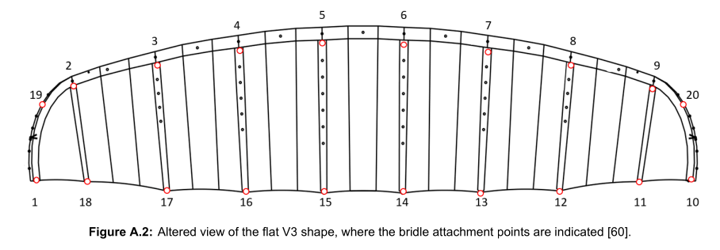
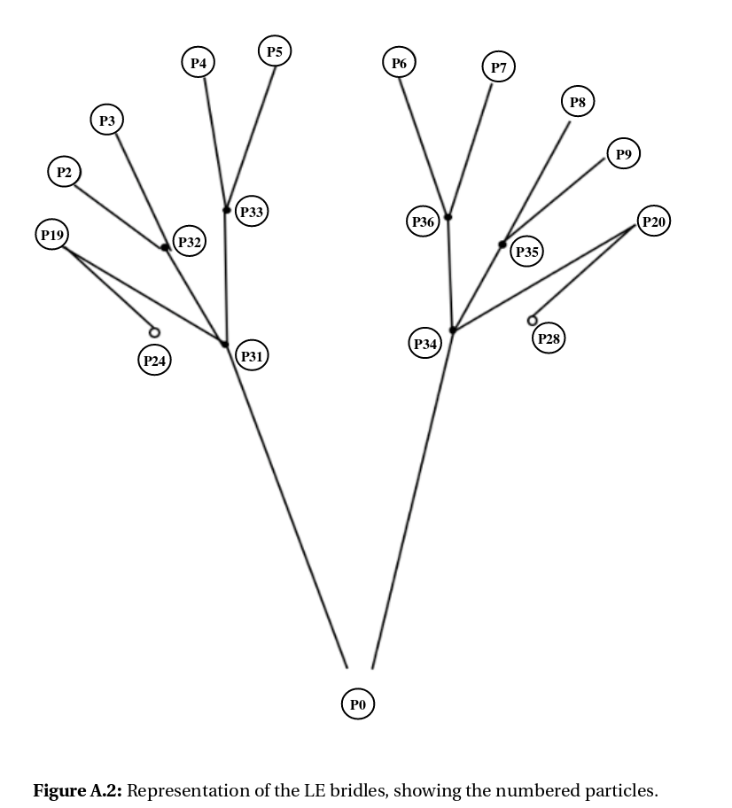
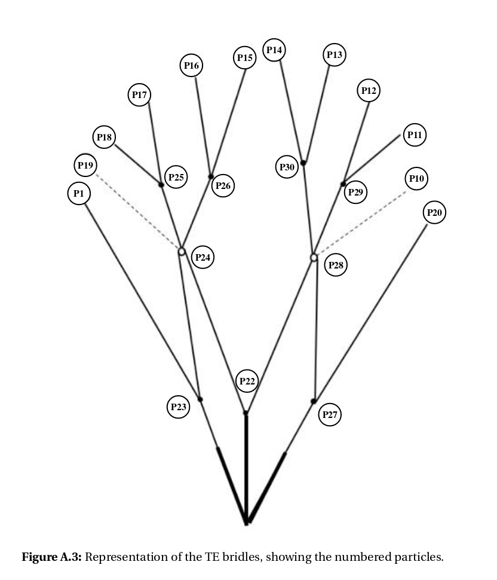

## Data content
The data consists of input and output.
In input `paths.yaml` describes the paths to the necessary **input and output** files.

## V3 data structure ##
For the V3 kite the `points.npy` file is read which contains all the structural nodes that are used for the calculation procedure.
These nodes are stored as np.array in x,y,z and are structured as follows:

| indices | python | Description | 
| --- | --- | --- |  
| 0 | points[0] | Bridle Point |
| (1,2..,20) | points[1:21] | Wing Nodes |
| (21,22,..37) | points[21:-1] | Bridle Nodes |

2. Wing Nodes 

The wing nodes consists of the bridle Line Attachment Points(LAPs), of which one is located at the Leading-edge and one at the Trailing-edge of the kite. The indices are shown here.

2. Bridle Nodes 

The indices of the bridle line nodes are shown here.

