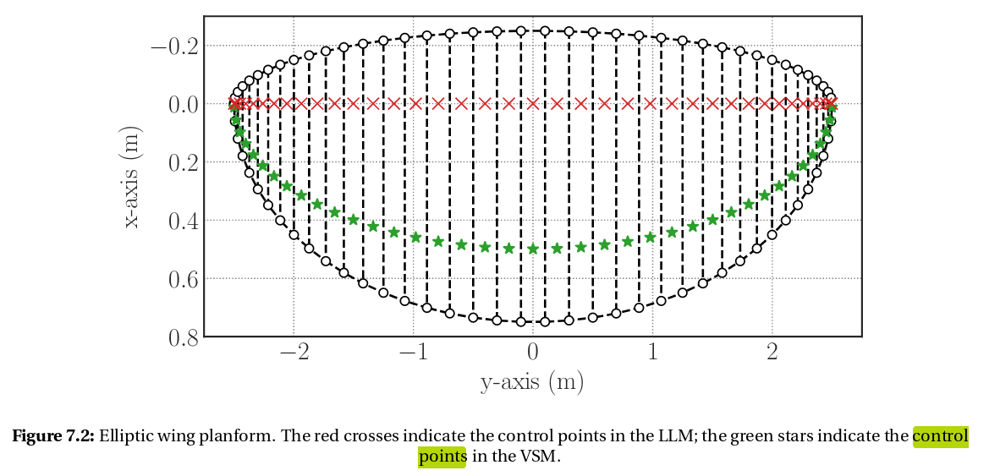

# Aerodynamic package

## Files Structure
| File/Directory | Content |
| -------------- | ------- |
| breukels_2D.py | Description or purpose of `breukels_2D.py`. |
| bridle_line_system_aero.py | Description or purpose of `bridle_line_system_aero.py`. |
| __init__.py | An initialization file for the `aerodynamic` package. |
| plate_aero.py | Description or purpose of `plate_aero.py`. |
| __pycache__ | Contains Python byte code files for faster loading. |
| tether_aero.py | Description or purpose of `tether_aero.py`. |
| VSM.py | Description or purpose of `VSM.py`. |

Please replace "Description or purpose of `file_name`" with the actual description or purpose of each file.

# Variables Structures

- `wingpanels`, stored as a array where each entry is a panel, arange from left-to-right. Each entry, representing a panel, is saved as a dict where the keys are: 'p1','p2','p3','p4' and the corresponding values the coordinates saved as np.array([x,y,z]). The points are arange counter-clockwise; 'p1' is the left point on the LE, 'p2' the right point on the LE, 'p3' the right point on the TE, 'p4' the left point on the TE.
  - 

- `controlpoints` are a dictionairy containing the following items:               
  - "coordinates": VSMpoint | a point as np.array(x,y,z)
    - 
  - "chord": chord | length as float
  - "normal": normal | unit-vector as np.array(x,y,z)
  - "tangential": tangential | unit-vector as np.array(x,y,z)
  - "airf_coord": airf_coord | 3 points as np.array(x,y,z) ?
  - "coordinates_aoa": LLpoint | point as np.array(x,y,z)

